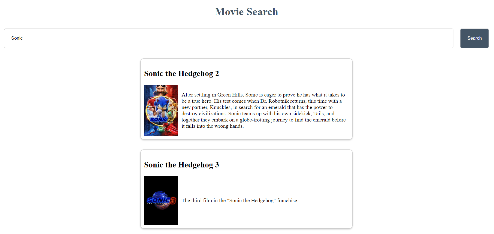

# Running the Vue.js Frontend

To run the Vue.js frontend, follow these steps:

1. Open a new terminal.

2. Navigate to the `webapp` directory:

    ```bash
    cd webapp
    ```

3. Install the necessary dependencies:

    ```bash
    npm install
    ```

4. Start the server:

    ```bash
    npm run serve
    ```

The server should now be running at `http://localhost:3000` (or whatever port you've configured).


# Running the Node.js Backend

The Node.js backend is dependent on a `.env` file being present in the webservice directory. The `.env` file contiains the `ACCESS_TOKEN` for TMDB API. To run the Node.js backend, follow these steps:

1. Open your terminal.

2. Navigate to the `webservice` directory:

    ```bash
    cd webservice
    ```

3. Install the necessary dependencies:

    ```bash
    npm install
    ```

4. Start the server:

    ```bash
    node server.js
    ```

The server should now be running at `http://localhost:3001`


# Example 
An example with both front-end and back-end running searching Sonic

